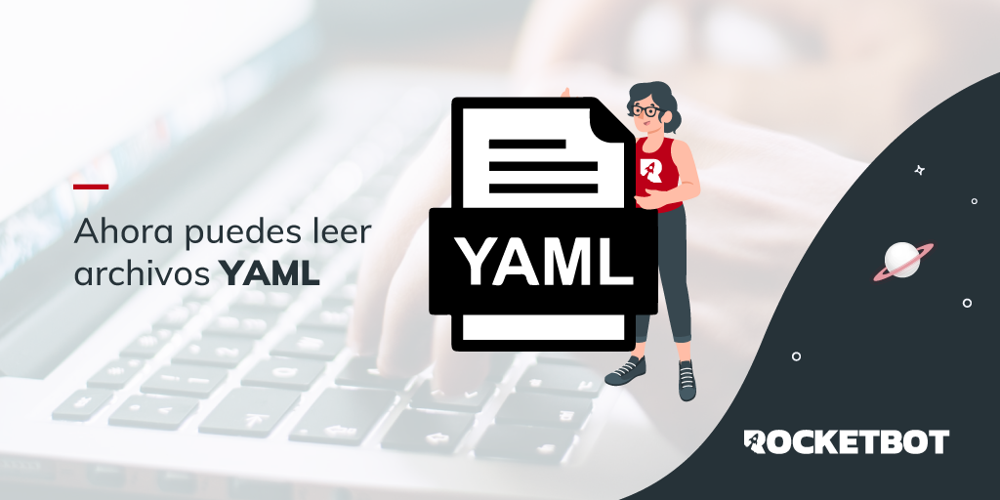

# yamlReader
  
Módulo para interactuar con archivos YAML. Ahora puedes leer archivos yaml. 

*Read this in other languages: [English](Manual_yamlReader.md), [Español](Manual_yamlReader.es.md).*
  

## Como instalar este módulo
  
__Descarga__ e __instala__ el contenido en la carpeta 'modules' en la ruta de Rocketbot.  

## Descripción de los comandos

### Leer archivo YAML
  
Leer archivo YAML y guardar resultado en variable
|Parámetros|Descripción|ejemplo|
| --- | --- | --- |
|Archivo YAML|Ruta del archivo YAML a leer|C:\Users\Robot\Desktop\archivo.yaml|
|Asignar a variable|Variable donde se guardará el resultado|var|
